# ezplot

**Dead-simple, fast plotting for Python.**

One-liners · PNG / JPEG / SVG · zero *required* dependencies · production knobs.

<p align="center">
  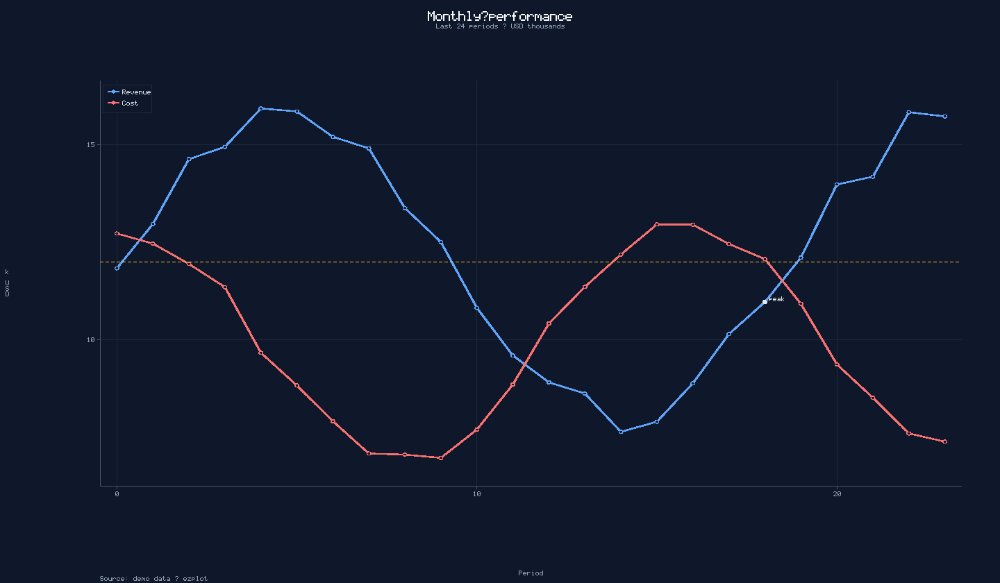
</p>

```python
import ezplot as ez

ez.line([1, 3, 2, 5], t="Growth", save="growth.png")
ez.bar({"A": 10, "B": 25}, t="Sales", save="sales.jpg")
```

---

## New Release Showcase (v1.5.0)

Explore the incredible new power of `ezplot`! We now feature a fully automated and intelligent **Datetime Axis**, along with **Infinite Customizability** via post-render primitive overlays or custom user series rendering.

| Smart Datetime Axis | Infinite Custom Drawing Overlays |
|:--:|:--:|
| 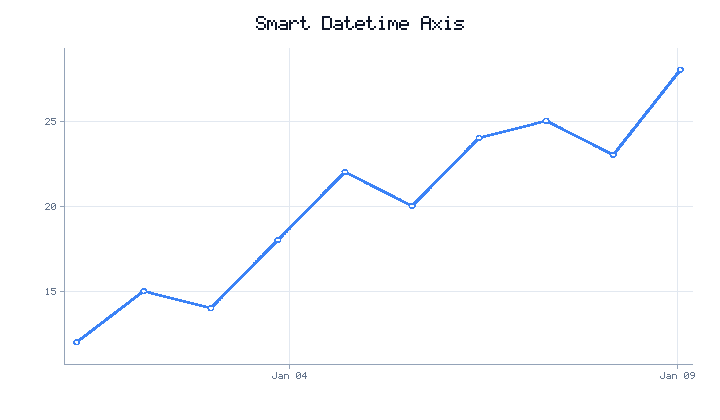 | 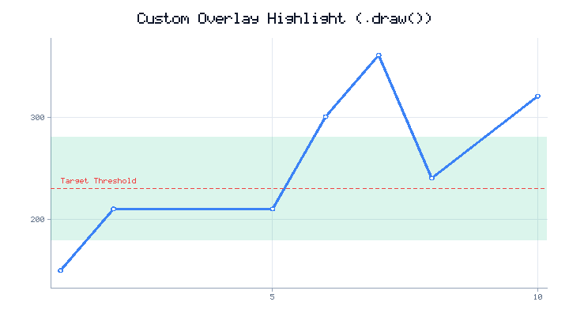 |
| *Auto-scaled dates, auto-formatted & auto-rotated labels* | *Drawn target regions, custom dashed thresholds, text layers* |

---

## Install

```bash
# from GitHub
pip install "git+https://github.com/ezplot/ezplot.git"

# or clone / local
git clone https://github.com/ezplot/ezplot.git
cd ezplot
pip install -e .

# optional — only for JPEG / WebP (PNG is built-in)
pip install pillow
# or:
pip install -e ".[images]"
```

**Python 3.8+** · MIT license

---

## Gallery

| | |
|:--:|:--:|
| 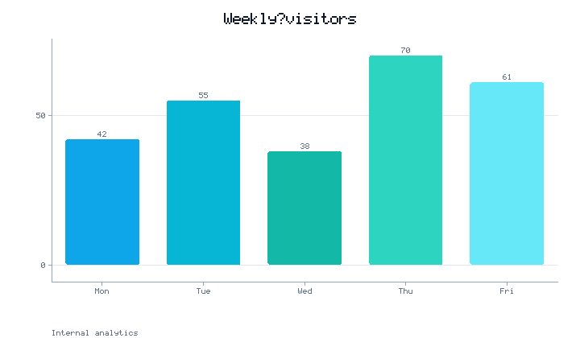 | 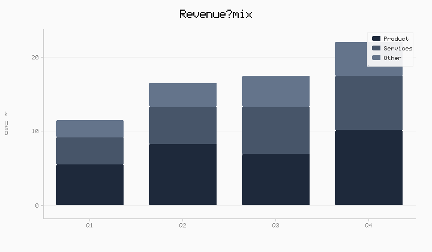 |
| *Bar + value labels* | *Stacked multi-series* |
| 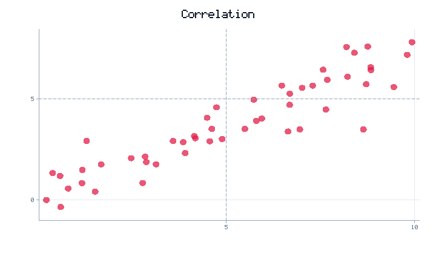 | 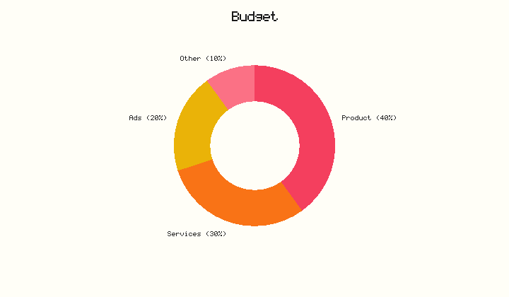 |
| *Scatter + ref lines* | *Donut (paper theme)* |
| 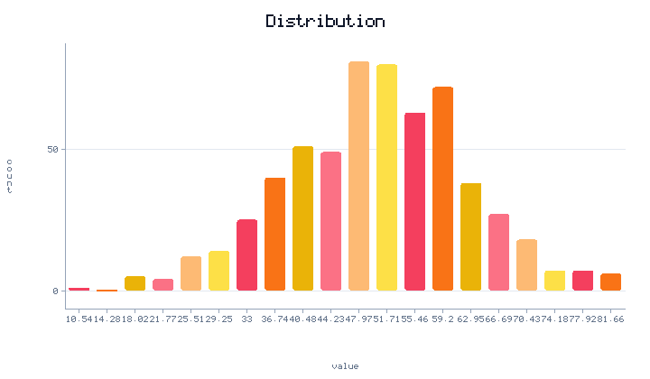 | 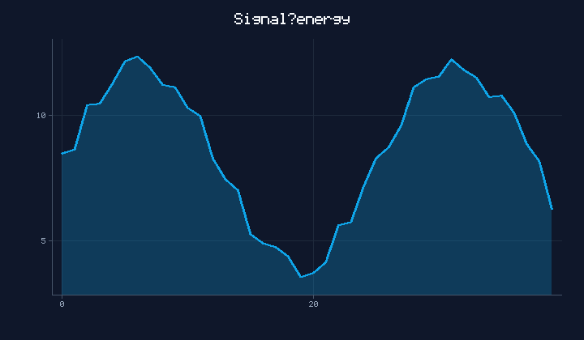 |
| *Histogram* | *Area (dark)* |
| 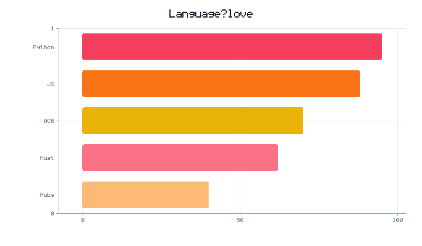 | 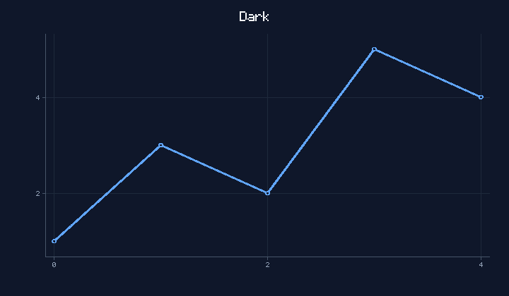 |
| *Horizontal bars* | *Dark theme* |

---

## Super short API

```python
import ezplot as ez

# style + save in one call
ez.line([1, 3, 2, 5], t="Hi", c="coral", save="hi.png")
ez.bar({"Mon": 12, "Tue": 19}, t="Visitors", save="v.jpg")
ez.pie({"A": 40, "B": 60}, donut=True, save="pie.png")
ez.hist(samples, 20, t="Dist", save="hist.png")
ez.auto(data, save="chart.png")          # picks chart type
ez.quick([1, 2, 3, 5])                   # auto + show

# fluent
(
    ez.line(x, [y1, y2], labels=["A", "B"])
    .t("Revenue")
    .subtitle("FY2026")
    .xlabel("Month").ylabel("USD")
    .theme("dark")
    .axhspan(80, 120, color="#22c55e", alpha=0.15)  # target zone (background)
    .hline(100, color="#fbbf24")                    # target line
    .annotate(6, y1[6], "launch")
    .legend_pos("top-left")
    .footnote("Source: finance")
    .dpi(2)                                         # retina PNG
    .png("out.png")
)
```

### Datetime Axis Intelligence

`ezplot` automatically understands Python `datetime.datetime` and `datetime.date` objects. It coerces them to Unix timestamps, computes nice tick intervals automatically based on the axis span (from years down to seconds), and formats and auto-rotates crowded labels dynamically!

```python
import datetime
import ezplot as ez

dates = [datetime.datetime(2026, 1, i) for i in range(1, 11)]
values = [12, 15, 14, 18, 22, 20, 24, 25, 23, 28]

ez.line(dates, values, t="Smart Datetime Axis", save="dates.png")
```

### Infinite Customizability (Create ANY Chart)

With `ezplot 1.5.0`, you are no longer limited to built-in chart types. You can create **any** chart you can imagine using our primitive drawing API or our post-render `.draw()` callback.

#### Unified Primitive Drawing API
Both `SVGRenderer` and `RasterRenderer` expose the same clean, fast drawing methods with full **color-parsing alpha/opacity** support:
- `to_pixels(x, y)`: Converts data coordinates to screen pixels.
- `draw_line(x1, y1, x2, y2, color, width=1.5, dashed=False, raw_coords=False, opacity=1.0)`
- `draw_rect(x, y, w, h, color, fill=True, stroke_color=None, stroke_width=1.0, radius=0.0, raw_coords=False, opacity=1.0)`
- `draw_circle(cx, cy, r, color, fill=True, stroke_color=None, stroke_width=1.0, raw_coords=False, opacity=1.0)`
- `draw_text(x, y, text, color, size=11, align="start", raw_coords=False, opacity=1.0)`
- `draw_polygon(pts, color, fill=True, stroke_color=None, stroke_width=1.0, raw_coords=False, opacity=1.0)`

#### 1. Post-Render Overlays (`.draw()`)
Easily overlay annotations, custom target lines, or extra graphics using a fluent chain:
```python
def draw_threshold_markers(r):
    # Draw custom annotations on the fly
    r.draw_line(r.x0, 230, r.x1, 230, "red", width=1.5, dashed=True)
    r.draw_text(r.x0 + (r.x1 - r.x0) * 0.02, 238, "Threshold", "red")

(
    ez.line(x, y)
    .t("Metrics")
    .draw(draw_threshold_markers)
    .save("metrics_threshold.png")
)
```

#### 2. High-level Background Spans (`.axhspan()` & `.axvspan()`)
Draw professional target bands or background highlight regions underneath your data series so your plot lines and markers are never obscured:
```python
(
    ez.line(x, y)
    .t("Metrics Highlight")
    .axhspan(180, 280, color="#10b981", alpha=0.15)  # Target safe zone
    .axvspan(1.5, 3.5, color="#3b82f6", alpha=0.10)  # Highlight phase
    .save("metrics_highlight.png")
)
```

#### 2. Custom Series (`kind="custom"`)
Build fully custom series types (like boxplots, candlestick charts, error bars, step charts) by providing a render function as the `color` attribute:
```python
def draw_error_bars(r):
    # Custom rendering logic using r.draw_line(), r.draw_circle() etc.
    for px, py in zip(x, y):
        r.draw_line(px, py - 2, px, py + 2, "red", width=2)
        r.draw_circle(px, py, 4, "blue")

p = ez.Plot(kind="custom")
p.add(x, y, color=draw_error_bars)
p.save("custom_chart.png")
```

### Shortcuts

| Short | Means |
|-------|--------|
| `t=` / `.t()` | title |
| `c=` / `.color()` | color |
| `w=` / `h=` | size |
| `lw=` | linewidth |
| `s=` | point size |
| `hbar=True` / `.horizontal()` | horizontal bars |
| `stacked=True` / `.stacked()` | stacked bars |
| `save="f.png"` | write by extension |
| `.png()` / `.jpg()` | explicit helpers |

---

## Customization (production-ready)

### Process-wide defaults

```python
ez.defaults(theme="dark", width=900, height=480, dpi=2, quality=92)
ez.line(y, t="Uses dark + retina automatically", save="a.png")

ez.reset_defaults()   # back to factory settings
```

### Per-plot controls

```python
(
    ez.bar(cats, vals)
    .t("Title").subtitle("Context line")
    .footnote("Source / notes")
    .theme("minimal").palette("ocean")
    .bg("#0b1220")                 # override background
    .legend_pos("bottom-right")    # tr | tl | br | bl
    .grid(False).tight()
    .margin(left=80, bottom=70)
    .xlim(0, 10).ylim(0, 100)
    .xticks([0, 5, 10]).yticks([0, 50, 100])
    .hline(50, color="orange", dashed=True)
    .vline(3, color="#94a3b8")
    .annotate(4, 80, "note", color="#ef4444")
    .values()                      # bar labels
    .stacked()                     # multi-series bars
    .dpi(2).save("report.png")
)
```

### Themes

| light | dark | minimal | paper |
|:--:|:--:|:--:|:--:|
| 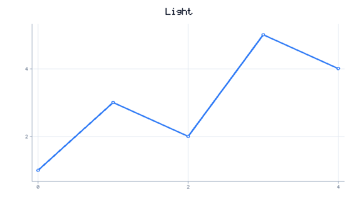 |  | 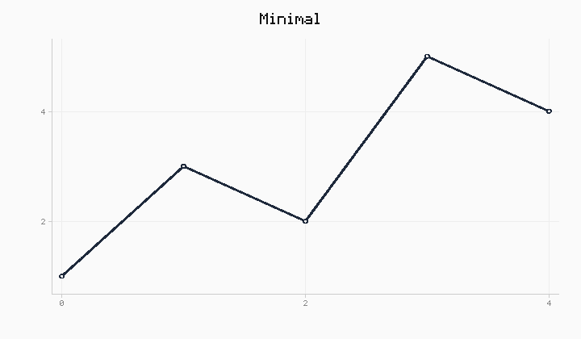 | 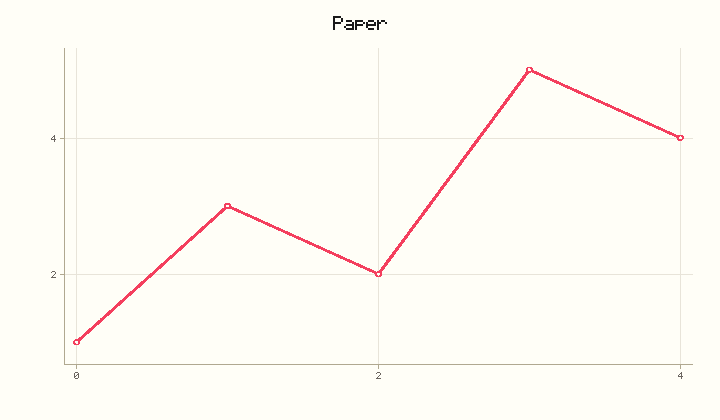 |

```python
ez.set_theme("dark")   # global
ez.line(y, theme="paper", palette="sunset", save="x.png")
```

**Palettes:** `default` · `pastel` · `dark` · `mono` · `ocean` · `sunset`

---

## Image formats

| Extension | Backend |
|-----------|---------|
| **`.png`** | **Built-in** (pure Python) |
| `.jpg` / `.jpeg` | Pillow |
| `.webp` | Pillow |
| `.svg` | Built-in vector |
| `.html` | Built-in page |

```python
p = ez.line([1, 2, 3, 5]).t("Demo")
p.save("a.png")           # PNG
p.save("a.jpg")           # JPEG
p.save("a.svg")           # SVG
p.png("a.png")
p.jpg("a.jpg", quality=85)
raw = p.png_bytes()       # for APIs / HTTP responses
img = p.image()           # PIL.Image (needs Pillow)
```

---

## Smart inputs

```python
ez.bar({"A": 10, "B": 20})           # dict → bar
ez.pie({"X": 40, "Y": 60})           # dict → pie
ez.scatter([(1, 2), (3, 1), (4, 5)]) # pairs
ez.line({"A": [1, 2], "B": [2, 1]})  # named series
ez.bar(["cat", "dog", "cat"])        # frequency count
ez.line([1, None, 4, 5])             # NaN gaps OK
ez.auto(anything)                    # pick the chart
```

---

## Why ezplot?

| | Matplotlib | **ezplot** |
|---|---|---|
| First plot | many lines | **1 line** |
| PNG | needs backend | **built-in** |
| Dependencies | heavy | **none** (Pillow optional) |
| Style | verbose | `t=`, `c=`, `save=` |
| Defaults | rcParams maze | `ez.defaults(...)` |

Typical PNG render: **~5–15 ms** for common charts (pure Python).

---

## Develop / test

```bash
git clone https://github.com/ezplot/ezplot.git
cd ezplot
pip install -e ".[dev,images]"
python tests/test_basic.py
python examples/demo.py          # writes examples/out/*.png
```

## Project layout

```
ezplot/
├── ezplot/           # package
├── docs/             # README gallery images (relative paths)
├── examples/demo.py
├── tests/test_basic.py
├── pyproject.toml
├── LICENSE
└── README.md
```

## License

MIT
